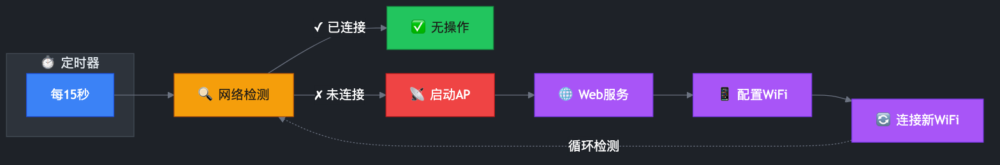

<p align="center">
  
</p>

<h1 align="center">RPi-WiFi-Fallback</h1>

<p align="center">
  <strong>树莓派 WiFi 回退机制</strong><br>
  断网时自动启动 AP 热点 + 强制门户，无需显示器即可配置 WiFi
</p>

<p align="center">
  <a href="#快速开始">快速开始</a> •
  <a href="#功能特性">功能特性</a> •
  <a href="#配置说明">配置说明</a> •
  <a href="#常见问题">常见问题</a>
</p>

<p align="center">
  
  
  
  
</p>

<p align="center">
  <strong>简体中文</strong> | <a href="README_EN.md">English</a>
</p>

---

## 功能特性

- **自动检测**：每 15 秒检查 WiFi 连接状态
- **AP 热点回退**：连接失败时自动启动 WPA2 加密的 AP 热点
- **强制门户**：连接热点后自动弹出配置页面（支持 iOS/Android/Windows）
- **Web 配置界面**：移动端友好的 WiFi 配置页面
- **自动恢复**：配置新 WiFi 后自动关闭热点并尝试连接

## 适用环境

### 兼容系统

| 系统 | 版本 | 状态 |
|------|------|------|
| Raspberry Pi OS | 64-bit (Debian Bookworm) | ✅ 已测试 |
| Raspberry Pi OS | 64-bit (Debian Trixie) | ✅ 已测试 |

### 兼容硬件

| 硬件 | 架构 | 状态 |
|------|------|------|
| Raspberry Pi Zero W / WH | aarch64 (64-bit ARM) | ✅ 已测试 |
| Raspberry Pi Zero 2 W / WH | aarch64 (64-bit ARM) | ✅ 已测试 |
| Raspberry Pi 3B / 3B+ | aarch64 (64-bit ARM) | ✅ 兼容 |
| Raspberry Pi 4B | aarch64 (64-bit ARM) | ✅ 兼容 |
| Raspberry Pi 5 | aarch64 (64-bit ARM) | ✅ 兼容 |

> **注意**：需要带有 WiFi 功能的树莓派，且必须运行 64 位系统。

### 依赖要求

| 依赖 | 说明 |
|------|------|
| NetworkManager | 网络管理服务（系统通常已预装） |
| nftables | 防火墙框架（Bookworm/Trixie 默认） |
| Python 3.11+ | 运行 Web 配置界面 |

## 快速开始

### 一键安装

```bash
# 下载并运行安装脚本
curl -sSL https://raw.githubusercontent.com/CairoLee/RPi-WiFi-Fallback/main/dist/setup.sh | sudo bash -s install
```

### 手动安装

```bash
# 克隆仓库
git clone https://github.com/CairoLee/RPi-WiFi-Fallback.git
cd RPi-WiFi-Fallback

# 运行安装脚本
sudo ./setup.sh install
```

> **📶 默认热点信息**
>
> 当 WiFi 连接失败时，树莓派会自动创建以下 AP 热点：
>
> | 项目 | 默认值 |
> |------|--------|
> | 热点名称 | `RPi-WiFi-Setup` |
> | 热点密码 | `raspberry2026` |
>
> 如需自定义热点名称或密码，请参阅下方 [配置说明](#配置说明) 章节。

### 卸载

```bash
sudo ./setup.sh uninstall
```

## 工作原理

<p align="center">
  
</p>

<details>
<summary>📝 流程说明</summary>

1. **systemd 定时器** - 每 15 秒触发一次检查
2. **网络检测** - 通过检测默认网关判断网络连接状态
3. **已连接** - 网络正常时无需任何操作
4. **未连接** - 启动 AP 热点模式
5. **Web 服务** - 启动强制门户，引导用户配置
6. **用户配置** - 通过 Web 界面选择并连接新 WiFi
7. **恢复连接** - 关闭热点，连接新配置的 WiFi 网络

</details>

## 配置说明

### 方式一：环境变量（推荐用于一键安装）

通过环境变量自定义配置，无需修改文件：

```bash
# 一键安装时自定义配置
curl -sSL https://raw.githubusercontent.com/CairoLee/RPi-WiFi-Fallback/main/dist/setup.sh | \
  WIFI_AP_SSID="Raspberry-Pi-WiFi" \
  WIFI_AP_PASSWORD="secret123" \
  sudo -E bash -s install
```

支持的环境变量：

| 环境变量 | 说明 | 默认值 |
|----------|------|--------|
| `WIFI_AP_SSID` | AP 热点名称 | `RPi-WiFi-Setup` |
| `WIFI_AP_PASSWORD` | AP 热点密码（至少8个字符） | `raspberry2026` |
| `WIFI_AP_CONNECTION_NAME` | NetworkManager 连接名称 | `RPi-WiFi-Setup-Hotspot` |
| `WIFI_AP_IP` | AP IP 地址范围 | `192.168.4.1/24` |

### 方式二：编辑配置文件

克隆仓库后，安装前编辑 `config.sh`：

```bash
WIFI_AP_SSID="RPi-WiFi-Setup"                      # AP 热点 SSID
WIFI_AP_PASSWORD="raspberry2026"                   # AP 热点密码（至少8个字符）
WIFI_AP_CONNECTION_NAME="RPi-WiFi-Setup-Hotspot"   # NetworkManager 连接名称
WIFI_AP_IP="192.168.4.1/24"                        # AP IP 地址范围
```

## 开发指南

### 项目结构

```
rpi-wifi-fallback/
├── config.sh           # 用户配置文件
├── build.sh            # 构建脚本
├── src/                # 源文件目录
│   ├── lib/            # Shell 脚本库
│   ├── templates/      # 部署模板
│   └── main.sh         # 脚本入口
├── dist/
│   └── setup.sh        # 构建输出（部署用单文件）
├── scripts/            # 运维脚本
└── docs/               # 文档目录
```

### 开发流程

```bash
# 1. 修改源文件
vim src/templates/app.py

# 2. 构建
./build.sh

# 3. 部署到树莓派
./scripts/deploy.sh
```

### 安装的组件

| 文件 | 位置 | 说明 |
|------|------|------|
| `wifi-fallback.sh` | `/usr/local/bin/` | WiFi 检测脚本 |
| `wifi-fallback.timer` | `/etc/systemd/system/` | 定时触发（每 15 秒） |
| `wifi-fallback.service` | `/etc/systemd/system/` | 回退服务单元 |
| `wifi-config.service` | `/etc/systemd/system/` | Web 配置服务 |
| `app.py` | `/opt/wifi-config/` | Flask Web 应用 |

## 常见问题

### 强制门户页面不弹出

部分浏览器或系统可能需要手动访问 `http://192.168.4.1`。

> **💡 iPhone 小技巧**
>
> 如果 iPhone 连接热点后没有自动弹出门户页面，可以在 WiFi 设置界面点击已连接的热点名称（如 `RPi-WiFi-Setup`）右侧的 ⓘ 详情按钮，然后返回，通常就会触发门户页面弹出。

### 查看运行日志

```bash
# 查看系统日志
journalctl -t wifi-fallback -f

# 查看调试日志
cat /tmp/wifi-fallback.log
```

## 许可证

本项目采用 [MIT License](LICENSE) 开源许可证。

## 贡献

欢迎提交 Issue 和 Pull Request！

- [提交问题](https://github.com/CairoLee/RPi-WiFi-Fallback/issues)
- [贡献代码](https://github.com/CairoLee/RPi-WiFi-Fallback/pulls)
